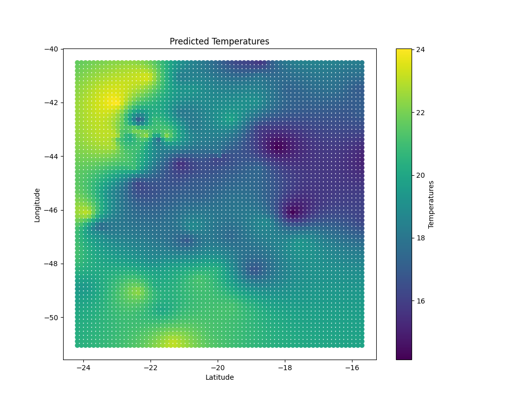
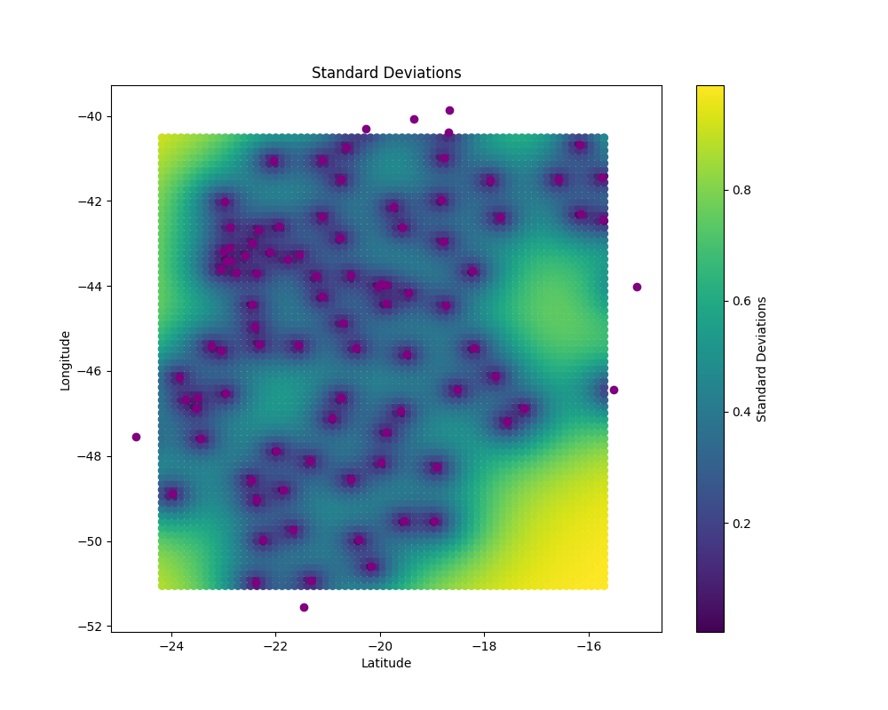

Gaussian Processes to Model Temperature

(a)
The Gaussian Process assumes that temperature at each point follows a Gaussian model i.e they are random variables.Jointly, they form a multivariate Gaussian distribution. What we are doing is calculating the mean and covariance matrices that define the normal distribution of the training and test points. We are using a mean function of 20 (presumably the average temperature in the area), along with a covariance function that is exponential to the Euclidean distance between 2 points. Hence, if 2 points are extremely close, there is very little covariance. This makes sense since 2 points which are very close presumably have very similar temperatures. Hence, the above problem can be solved using a Gaussian process. 

(b)
MSE obtained using computed posterior mean = 2.413175446318362

MSE obtained by predicting average of $y_{tr}$ = 6.422837006905682

(c)
Predicted (posterior mean) temp at all 5000 points in grid: Please refer to Figure 1

Standard deviation of prediction at all 5000 points in the grid: Please refer to Figure 2

As we can see the standard deviation is lowest around the training points. This makes sense because as distance from the training points increases, we become less sure about the temperature prediction from the known values. Hence, as distance from training points increases, the standard deviation also increases.
